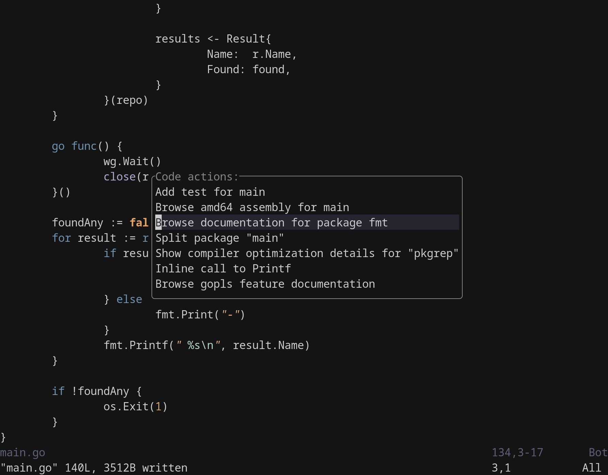

A simple (~40 LOC) implementation of vim.ui.select using a floating window.



## Usage

```lua
vim.ui.select = require('simple-select')
```

Example file picker implementation using vim.ui.select:

```lua
local function select_file()
  local files = {}
  for path, path_type in vim.fs.dir(vim.fn.getcwd(), { depth = math.huge }) do
    if path_type == 'file' then
      table.insert(files, path)
    end
  end

  vim.ui.select(files, {
    prompt = 'Edit a file:',
  }, function(selected_file)
    if selected_file then
      vim.cmd('edit ' .. selected_file)
    end
  end)
end

vim.keymap.set('', '<Leader>f', select_file, {})
```
